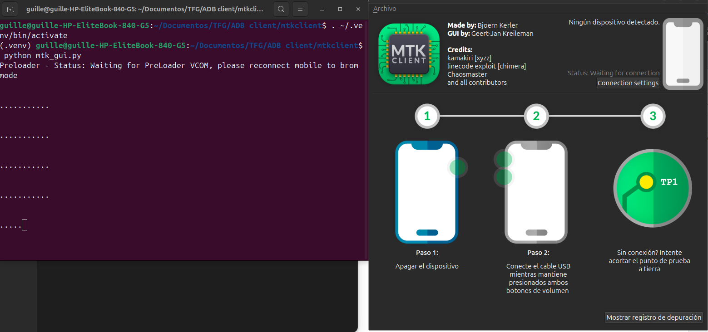
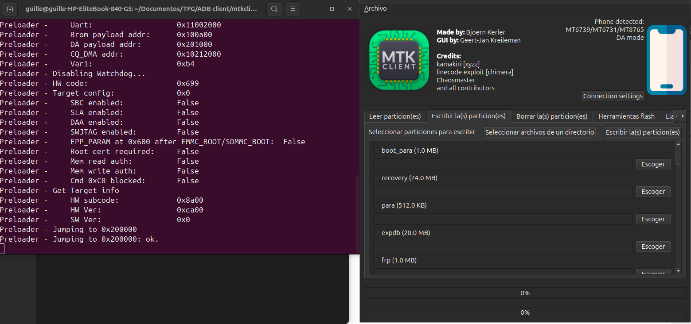
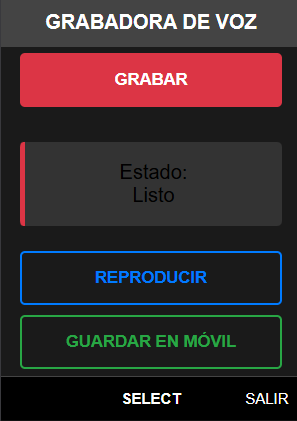
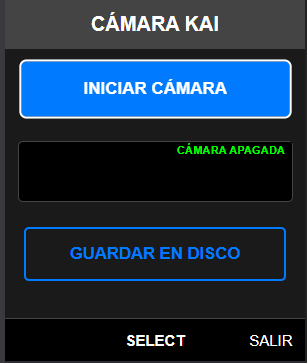
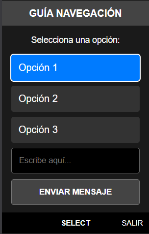
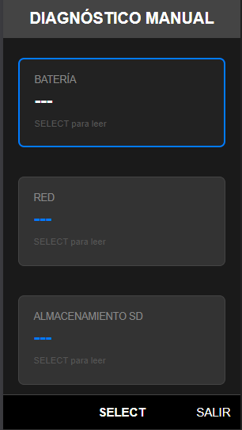
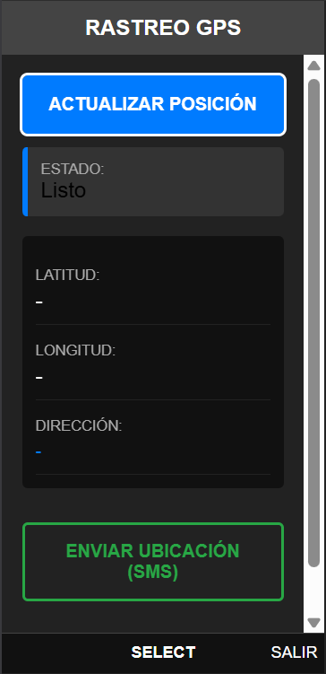

# Introduction-to-KaiOS-Development


A beginner-friendly guide and code examples for developing applications for KaiOS, the OS powering smart feature phones.
Here you will find everything from bypassing Original Equipment Manufacturer (OEM) restrictions to activate developer mode, to practical open-source projects interacting with the device's physical hardware.

---

**:computer: Built With:**

- HTML5, CSS3, Vanilla JavaScript

- WebAPIs & Mozilla Device APIs

- KaiOS 2.5 / 3.0 Ecosystem

---

## :bookmark_tabs: Table of Contents
1. [:globe_with_meridians: Introduction to the KaiOS Ecosystem](#globe_with_meridians-1-introduction-to-the-kaios-ecosystem)
2. [:hammer: Development Environment & Debugging](#hammer-2-development-environment--debugging)
3. [:building_construction: Architectural Differences: KaiOS 2.5 vs 3.0](#building_construction-3-architectural-differences-kaios-25-vs-30)
4. [:art: Best Practices, UI & UX (D-Pad Navigation)](#art-4-best-practices-ui--ux-d-pad-navigation)
5. [:iphone: Hardware Projects (Example Apps)](#iphone-5-hardware-projects-example-apps)
6. [:moneybag: Publishing & Monetization](#moneybag-6-publishing--monetization)
7. [:rocket: Ideas for Future Applications](#rocket-7-ideas-for-future-applications)
8. [:handshake: Contributing](#handshake-8-contributing)
9. [:books: Credits & References](#books-9-credits--references)
10. [:page_facing_up: License](#page_facing_up-10-license)

---

## :globe_with_meridians: 1. Introduction to the KaiOS Ecosystem

KaiOS is a web-based mobile operating system designed for phones with physical keyboards (T9) and directional pads (D-pads), operating on highly constrained hardware (256MB - 512MB RAM). Developing for this platform requires mastering modern web technologies (HTML5, CSS, JS) under extreme performance optimization constraints.

There are two main approaches to development:
1. **WebIDE Simulator:** Useful for UI testing, but severely limited when testing real hardware components.
2. **Physical Device (Recommended):** Activating *Developer* mode, connecting via ADB, and installing third-party apps via WebIDE (using Waterfox Classic) or through *OmniSD / Wallace Toolbox*.

---

## :hammer: 2. Development Environment & Debugging

The biggest challenge in KaiOS development is accessing the hidden developer menu. The method depends heavily on your phone's chipset:

- **Qualcomm-based:** Simply dial `*#*#33284#*#*` to activate the debugging tools.
- **Spreadtrum-based:** Dial the code above, and then dial `*#*#0574#*#*` to explicitly enable the USB debugger.
- **Mediatek-based (e.g. Blackview N1000 with MT6739):** Requires an advanced method known as **Cache Injection**.

<details>
<summary><b>:hammer_and_wrench: View Step-by-Step Tutorial: Cache Injection on MediaTek (Blackview N1000)</b></summary>

*Cache Injection* bypasses the factory lock by injecting modified files into the system partitions using `Fastboot`.

**1. Linux Preparation (Ubuntu/Debian):**
```bash
# Install dependencies
sudo apt install git build-essential curl libssl-dev python3-pip -y

# Clone and setup MTKClient
git clone https://github.com/bkerler/mtkclient --recursive
cd mtkclient
python3 -m venv .venv
source .venv/bin/activate
pip install -r requirements.txt
pip install .

# Setup permissions
sudo usermod -a -G plugdev $USER
sudo usermod -a -G dialout $USER
sudo cp mtkclient/Setup/Linux/*.rules /etc/udev/rules.d
sudo udevadm control -R
sudo udevadm trigger
deactivate
```
*Note: Restart your computer after applying these group changes for them to take effect.*

Install the dependencies and Pyenv (Python 3.10+ recommended). Ensure you configure the `udev` rules and add your user to the `dialout` and `plugdev` groups.

**2. Unlocking and Flashing with MTKClient:**
First, launch the GUI:
```bash
source .venv/bin/activate
python3 mtk_gui.py
```



- Status: Idle: The software is ready and awaiting device connection.
- Status: Device Linked: Once the phone is connected in BROM mode, the software identifies the SoC (MT6739) and enables the partition write tools.

- Go to the Flash Tool tab, and click Unlock to free the Fastboot.
- Go to Write partition(s) and select the modified `.bin` images (obtained from development forums) for the cache and boot partitions.

**Reboot and Use:**
After writing the partitions, reboot the device. The system will read the injected cache and permanently enable the "Developer" menu in Settings, allowing ADB access.
</details>

**Connection via Waterfox Classic and WebIDE**
*(Applies to all chipsets once Developer Mode is active)*
To install applications, we use Waterfox Classic, as modern Firefox versions removed the WebIDE component. Run the following command in your terminal to forward the debugging ports:
```bash
adb forward tcp:6000 localfilesystem:/data/local/debugger-socket
```
In Waterfox Classic, open WebIDE, select "Remote Runtime", connect to `localhost:6000`, and you will be able to live-debug and install your ZIP packages directly to the phone.

---

## :building_construction: 3. Architectural Differences: KaiOS 2.5 vs 3.0

It is vital to know which version you are targeting, as the underlying engines differ completely:

| Feature | KaiOS 2.5 (Gecko 48) | KaiOS 3.0 (Gecko 84) |
| ------------- | ------------- | ------------- |
| Structure  | Packaged App (ZIP) with `manifest.webapp` | Standard PWA with `manifest.webmanifest` |
| WASM  | Not supported (Uses compiled `asm.js`) | Natively supported  |
| App API | Proprietary `mozApps` API  | Standard Web API Apps Manager  |
| DevTools  | Accessible via hacks / dial codes  | Completely locked down on commercial devices |

---

## :art: 4. Best Practices, UI & UX (D-Pad Navigation)

KaiOS does not have touch screens. Everything relies on DOM Focus management and mathematical scroll manipulation.

**:white_check_mark: DOs:**

- **Keep Apps Small:** Under 4MB is ideal. Minify your JS/CSS aggressively.

- **Clear Focus States:** Use CSS (`:focus`) to highlight elements strongly (e.g., color inversion, thick borders).

- **D-Pad Management:** Capture `ArrowUp`, `ArrowDown`, `SoftLeft`, `SoftRight` events and interact using `document.activeElement`.

- **Theme Color:** use `<meta name="theme-color" content="rgb(255, 255, 255)" />` (make sure to include spaces after commas) so the system Status Bar intelligently adapts its contrast.

**:x: DON'Ts:**

- **Animate complex properties:** Stick to `transform` and `opacity` to avoid layout thrashing and out-of-memory (OOM) crashes.

- **Exceed storage limits:** The `localStorage` API has a hard 5MB quota.

- **Use heavy frameworks:** Avoid React or Angular. Prefer Vanilla JS, Svelte, or Preact.

- **Rely on emulated cursors:** Setting `"cursor": true` in the manifest creates a slow, frustrating mouse-like experience. Build native D-pad navigation instead.

---

## :iphone: 5. Hardware Projects (Example Apps)

Inside the `HARDWARE APPS` directory, I have developed 6 practical applications demonstrating how to interact with the phone's sensors and hardware.

<details>
  
<summary><b>:brain: The "Mathematical Scroll" Concept:</b></summary>

Since older Gecko engines struggle with modern CSS `scroll-snap`, all these apps implement a custom JavaScript formula (`offsetTop - contentHeight / 2 + itemHeight / 2`) to ensure the focused element is always perfectly centered on the small 2.4" screen.

</details>

:microphone: **[1. AudioApp (KaiVoice)](HARDWARE%20APPS/AudioApp)**

Voice recording app with persistent storage.

- **Permissions:** `audio-capture`, `device-storage:music`.

- **Functionality:** Captures the microphone using `MediaRecorder`, generates an OGG Blob, and saves it directly to the SD card or internal memory using `navigator.getDeviceStorage`.

<details>
  <summary><b>:eyes: View Application Interface Screenshot</b></summary>
  
</details>

:camera: **[2. CameraApp (KaiCam)](HARDWARE%20APPS/CameraApp)**

Live camera viewfinder and photo capture.

- **Permissions:** `camera`, `video-capture`, `device-storage:pictures`.

- **Functionality:** Renders `getUserMedia` into a `<video>` tag, draws the exact frame onto a hidden `canvas`, and exports it as a JPEG directly to the user's gallery.

<details>
  <summary><b>:eyes: View Application Interface Screenshot</b></summary>
  
</details>

:keyboard: **[3. KeyBoardApp (KaiNav Guide)](HARDWARE%20APPS/KeyBoardNavigation)**

The ultimate keyboard navigation guide for complex interfaces.

- **Functionality:** Demonstrates advanced use of 2D matrices (NavMaps) to navigate UI grids with the D-pad without getting the focus stuck.

<details>
  <summary><b>:eyes: View Application Interface Screenshot</b></summary>
  
</details>

:gear: **[4. SystemApp (KaiSystem)](HARDWARE%20APPS/SystemApp)**

Diagnostic tool for reading system sensors.

- **Permissions:** `device-storage:sdcard`.

- **Functionality:** Extracts and displays real-time data from the Battery API (`mozBattery`), Network connection types, and calculates free storage space using asynchronous SD card requests.

<details>
  <summary><b>:eyes: View Application Interface Screenshot</b></summary>
  
</details>

:compass: **[5. TrackingApp (KaiTracking)](HARDWARE%20APPS/TrackingGPS)**

Real-time GPS tracker with Reverse Geocoding and SMS sharing.

- **Permissions:** `geolocation`, `systemXHR`.

- **Functionality:** Please use the app outdoors for a better GPS connection. Activates GPS via `watchPosition`.  Makes secure Cross-Origin requests (`systemXHR`) to Nominatim (OpenStreetMap) to convert coordinates into street names. Uses `MozActivity` to open the native SMS app and share the location link. 

<details>
  <summary><b>:eyes: View Application Interface Screenshot</b></summary>
  
</details>

---

## :moneybag: 6. Publishing & Monetization

Publishing on the KaiStore or JioStore requires strict adherence to design guidelines:

- **Icons:** Mandatory 56x56 and 112x112 px sizes (drop shadows recommended to stand out against system backgrounds).

- **Marketing Banner:** 240x130 px (Non-transparent JPG).

- **Screenshots:** Up to 5 images (240x320 px) completely free of debug icons in the top status bar.

- **Monetization:** If publishing on the KaiStore, integrating the **KaiAds SDK** is mandatory. (Revenue split is 30% dev / 70% Kai, with a minimum payout threshold of $500).

**:bulb: Note on Web Activities (Intents):** You can leverage `MozActivity` (KaiOS 2.5) or `WebActivity` (KaiOS 3.0) to open links, adjust network settings, or share files, enriching the user experience without reinventing the wheel.

---

## :rocket: 7. Ideas for Future Applications

Based on *Tom Barrasso* analysis of empty niches in the KaiStore:

- **Robocall Blocker:** A `certified` app using telephony APIs to block SPAM calls.

- **File Sync (FTP/WebDAV):** Transfer data over Wi-Fi without needing to physically extract the SD card from behind the battery.

- **Live Weather Radar:** Using canvas or Leaflet.js to show precipitation maps (currently almost non-existent on the platform).

- **Advanced Clipboard (Stash):** Since KaiOS lacks a global *Copy & Paste*, a centralized clipping app where users can send text via Web Activities would be highly useful.

---

## :handshake: 8. Contributing

Contributions are what make the open-source community such an amazing place to learn, inspire, and create. Any contributions you make are **greatly appreciated**.

1. Fork the Project
2. Create your Feature Branch (`git checkout -b feature/NameFeature`)
3. Commit your Changes (`git commit -m 'Explain changes of the new Feature'`)
4. Push to the Branch (`git push origin feature/NameFeature`)
5. Open a Pull Request

If you need more detailed instructions on code standards, repository rules, or environment limits, please consult the [CONTRIBUTING.md](CONTRIBUTING.md) guide before opening a pull request.

---

## :books: 9. Credits & References

Much of the knowledge compiled in this guide was extracted and inspired by the incredible KaiOS community and the following pioneers:

- [Tom Barrasso (KaiOS.dev)](https://kaios.dev/) - DevRel leadership and incredibly detailed technical information regarding APIs.

- [BananaHackers Community](https://sites.google.com/view/bananahackers) - Jailbreak procedures, OmniSD, and device Wiki.

- Forum user at [4PDA](https://4pda.to/forum/index.php?showtopic=1091871&st=160#entry134653032) for the Cache Injection images for the Blackview N1000.

- [MTKClient (Bkerler)](https://github.com/bkerler/mtkclient) for the MediaTek flashing utility.

- [Waterfox Classic](https://classic.waterfox.net/) browser download.

- [Alura Cursos - Cómo escribir un README increíble](https://www.aluracursos.com/blog/como-escribir-un-readme-increible-en-tu-github) - For the structure, organization, and best practices applied to this README.

- [GitHub Emoji Cheat Sheet (rxaviers)](https://gist.github.com/rxaviers/7360908) - For the comprehensive list of markdown emojis used to visually organize this guide.

---

## :page_facing_up: 10. License

Distributed under the MIT License. See the [LICENSE](LICENSE) file for more information.

---

**Project created by [Guillermo González Martín (@ggonzalez1998)](https://github.com/ggonzalez1998) for his Final Year Project (Trabajo de Fin de Grado).**
